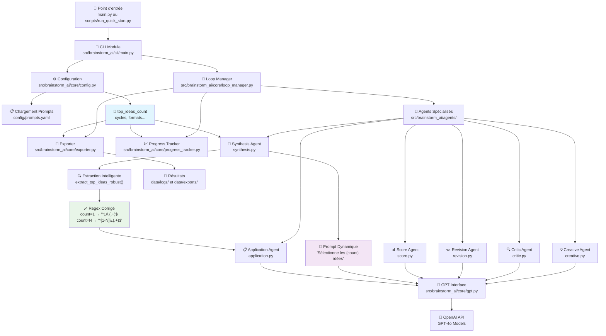
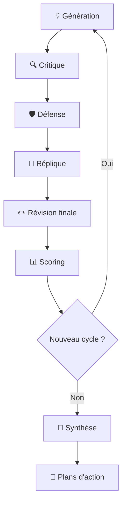

# 🧠 Brainstorm AI

Un système de brainstorming intelligent utilisant plusieurs agents IA spécialisés pour générer, critiquer, défendre et améliorer des idées de manière collaborative.

[](https://www.python.org/downloads/)
[](https://opensource.org/licenses/MIT)

[](docs/guides/PRIVACY_GUIDELINES.md)

## 🚀 Démarrage Ultra-Rapide

**Nouveau utilisateur ?** → Consultez [QUICK_START.md](docs/guides/QUICK_START.md) pour lancer votre premier brainstorm en 5 minutes !

### 💻 Installation Express

```bash
# Clonage et installation
git clone https://github.com/votre-username/brainstorm-ai.git
cd brainstorm-ai
pip install -e .

# Configuration rapide
cp config/env.example .env
# Éditez .env avec votre clé API OpenAI

# Lancement simplifié
python main.py                           # Point d'entrée principal
# ou
python scripts/run_quick_start.py        # Assistant interactif guidé
# ou Windows :
quick_start.bat                          # Lancement Windows en un clic
```


## 🎯 Description

Brainstorm AI simule un processus de brainstorming professionnel avec une équipe d'experts virtuels, chacun ayant un rôle spécialisé dans le processus créatif.

### 🤖 Les Agents Spécialisés

| Agent | Rôle | Température | Spécialité |
|-------|------|-------------|------------|
| **💡 Créatif** | Génération d'idées + Défense | 0.9 | Innovation, originalité et argumentation |
| **🔍 Critique** | Analyse objective + Réplique | 0.4 | Évaluation rigoureuse et contre-argumentation |
| **✏️ Révision** | Reformulation | 0.6 | Clarification et optimisation |
| **🧠 Synthèse** | Compilation | 0.5 | Structuration et hiérarchisation |
| **📊 Score** | Évaluation | 0.2 | Notation quantitative |
| **📌 Application** | Plans d'action | 0.6 | Mise en œuvre concrète et planification |

## 🏗️ Architecture et Flux d'Exécution

Voici comment tous les composants interagissent lors d'une session de brainstorming avec **corrélation garantie config ↔ logs** :



### 🎯 **Flux de Corrélation Configuration → Résultats**

```mermaid
sequenceDiagram
    participant Config as 📋 config.yaml
    participant Loop as 🔄 Loop Manager
    participant Synth as 🧠 Synthesis Agent
    participant Extract as 🔍 Extraction
    participant Export as 💾 Export
    
    Config->>Loop: top_ideas_count = 1
    Config->>Loop: cycles = 2
    
    Loop->>Synth: prompt_synthese(ideas, count=1)
    Synth->>Synth: "Sélectionne les 1 meilleures idées"
    
    Synth->>Extract: synthese_text
    Extract->>Extract: count=1 → regex "^1\\.(.+)$"
    Extract->>Loop: [1 idée extraite] ✅
    
    Loop->>Export: application_logs (1 idée)
    Export->>Export: 1 fichier .md généré
    
    Note over Config,Export: ✅ Corrélation Respectée !
```

> 📋 **Documentation complète** : [Flux d'Exécution Détaillé](docs/technical/SYSTEM_FLOW.md)  
> 🔧 **Corrections récentes** : [Corrélation Config ↔ Logs](docs/project/CORRECTION_CORRELATION_CONFIG.md)

## ✨ Caractéristiques Avancées

### 🔥 Nouvelles Fonctionnalités 2024
- **🚀 Scripts de lancement simplifiés** : `run.py` interactif et `start.bat` Windows
- **🔒 Sécurité renforcée** : Protection automatique des données sensibles

- **📱 Interface guidée** : Assistant pour configuration et estimations
- **⚡ Performance** : Architecture src/ optimisée pour la vitesse

### 🎯 Fonctionnalités Core
- **Processus itératif** : Système de cycles d'amélioration continue
- **Configuration flexible** : Personnalisation complète via `config/config.yaml`
- **Modèles IA optimisés** : Powered by GPT-4o pour des performances maximales
- **Export multi-format** : YAML, JSON, et Markdown
- **Gestion intelligente** : Détection de redondance et optimisation des tokens
- **Interface intuitive** : Affichage avec emojis et progression en temps réel
- **Historique complet** : Sauvegarde automatique de toutes les sessions
- **🎯 Corrélation garantie** : Configuration respectée fidèlement dans tous les logs
- **🔍 Extraction intelligente** : Regex adaptatif selon le nombre d'idées configuré
- **📊 Validation continue** : Scripts de test pour vérifier la cohérence config ↔ résultats

## 🛠️ Installation Détaillée

### Prérequis
- **Python 3.8+** (testé jusqu'à 3.11)
- **Clé API OpenAI** ([Obtenir ici](https://platform.openai.com/api-keys))
- **Git** (pour les fonctionnalités avancées)


### Installation Pip

```bash
# Installation des dépendances
pip install -r requirements.txt

# Mode développement (avec outils de test)
pip install -r requirements-dev.txt

# Installation en mode éditable
pip install -e .
```

### Configuration Sécurisée

```bash
# 1. Copier le modèle de configuration
cp config/env.example .env

# 2. Éditer avec votre clé API (JAMAIS dans Git !)
echo "OPENAI_API_KEY=sk-votre-clé-ici" >> .env

# 3. Vérifier la protection (ne doit PAS apparaître)
git status  # .env doit être ignoré
```

## 🎮 Utilisation

### 🚀 Méthodes de Lancement

#### 1. Assistant Interactif (Recommandé)
```bash
python scripts/run_quick_start.py
```
- Interface guidée pas à pas
- Estimation de coût et durée
- Vérification automatique de configuration
- Valeurs par défaut intelligentes

#### 2. Lancement Windows Simplifié
```bash
quick_start.bat
```
- Double-clic pour lancer
- Gestion d'erreur automatique
- Affichage des résultats

#### 3. Lancement Traditionnel
```bash
python main.py
```
- Mode direct avec confirmation
- Configuration via `config/config.yaml`

### 📋 Configuration Exemple

```yaml
# config/config.yaml
general:
  objectif: "Développer une stratégie de marketing digital innovante"
  contexte: "PME tech en croissance, budget limité, marché concurrentiel"
  contraintes: "Budget max 50K€, délai 6 mois, équipe de 3 personnes"
  cycles: 3
  top_ideas_count: 5      # 🎯 Contrôle précis du nombre d'idées
  ask_confirmation: true

agents:
  models:
    creatif: "gpt-4o"      # Créativité maximale
    critique: "gpt-4o"     # Analyse approfondie
    revision: "gpt-4o"     # Révision optimisée
    synthese: "gpt-4o"     # Synthèse de qualité
    score: "gpt-4o"        # Évaluation précise
    application: "gpt-4o"  # Plans d'action
    default: "gpt-4o"      # Modèle par défaut

export:
  formats:
    yaml: true
    json: true
    markdown: true
  save_individual_ideas: true  # Sauvegarde automatique des idées
```

### 🔧 Validation et Tests de Corrélation

Le système inclut des outils pour garantir que votre configuration est respectée :

```bash
# Débugger et vérifier la configuration
python scripts/check_config.py

# Démonstration du système sans API
python scripts/demo_progression.py
```

**Exemple de validation :**
```yaml
Configuration: top_ideas_count: 2, cycles: 1
Résultat garanti: Exactement 2 idées développées en 1 cycle ✅
```

## 📊 Processus de Brainstorming

### 🔄 Cycle de Développement d'Idées



### 📈 Évolution de la Qualité

| Cycle | Objectif | Résultat Attendu |
|-------|----------|------------------|
| **1** | Exploration large | 3 idées brutes diverses |
| **2** | Approfondissement | 3 idées enrichies et défendues |
| **3** | Perfectionnement | 3 idées finalisées et actionnables |

### 🎯 Synthèse Finale

1. **🧠 Compilation intelligente** : Fusion des meilleures idées
2. **📊 Ranking automatique** : Classement par scores objectifs  
3. **📌 Sélection TOP** : Extraction du nombre exact d'idées configuré (`top_ideas_count`)
4. **📋 Plans détaillés** : Roadmap de mise en œuvre pour chaque idée sélectionnée
5. **✅ Validation** : Corrélation garantie entre configuration et résultats exportés

## 📁 Structure du Projet

```
brainstorm_ai/
├── 🚀 Lancement rapide
│   ├── main.py                         # Point d'entrée principal
│   ├── quick_start.bat                 # Lancement Windows rapide
│   ├── scripts/
│   │   ├── run_quick_start.py         # Assistant interactif
│   │   └── start.bat                  # Script Windows avancé
│   └── docs/guides/QUICK_START.md     # Guide 5 minutes
├── 🧠 Code source
│   └── src/brainstorm_ai/
│       ├── agents/                     # Agents IA spécialisés
│       │   ├── creative.py            # 💡 Génération d'idées
│       │   ├── critic.py              # 🔍 Analyse critique
│       │   ├── revision.py            # ✏️ Révision et amélioration
│       │   ├── synthesis.py           # 🧠 Synthèse finale
│       │   ├── score.py               # 📊 Évaluation quantitative
│       │   └── application.py         # 📌 Plans d'action
│       ├── core/                      # Moteur principal
│       │   ├── gpt.py                 # 🤖 Interface OpenAI optimisée
│       │   ├── loop_manager.py        # 🔄 Orchestration des cycles
│       │   ├── config.py              # ⚙️ Gestion configuration
│       │   ├── exporter.py            # 📤 Export multi-format
│       │   └── progress_tracker.py    # 📊 Suivi temps réel
│       └── cli/                       # Interface ligne de commande
├── ⚙️ Configuration
│   ├── config/
│   │   ├── config.yaml                # Configuration principale
│   │   ├── prompts.yaml               # Prompts optimisés
│   │   └── env.example                # Modèle environnement
├── 🛠️ Outils et scripts
│   ├── scripts/
│   │   ├── run_quick_start.py         # Assistant de démarrage rapide
│   │   ├── check_config.py            # Validation configuration
│   │   ├── demo_progression.py        # Démonstration sans API
│   │   └── start.bat                  # Script Windows avancé
├── 📊 Données (🔒 protégées)
│   ├── data/
│   │   ├── logs/                      # Historique sessions
│   │   │   └── example_*.yaml         # ✅ Exemples publics
│   │   └── exports/                   # Idées exportées
│   │       └── example_*.txt          # ✅ Exemples anonymisés
├── 🧪 Tests
│   ├── tests/
│   │   ├── unit/                      # Tests unitaires
│   │   └── integration/               # Tests d'intégration
├── 📖 Documentation
│   └── docs/
│       ├── ARCHITECTURE.md            # Architecture détaillée
│       ├── cursor.rules               # Règles de développement
│       └── guides/                    # Guides utilisateur
├── 🔒 Sécurité
│   ├── PRIVACY_GUIDELINES.md          # Guide confidentialité
│   └── .gitignore                     # Protection données sensibles
└── 📄 Documentation
    ├── README.md                      # Ce fichier
    └── main.py                        # Point d'entrée legacy
```

## 🔒 Sécurité et Confidentialité

### ⚠️ Protection Automatique

Le projet protège automatiquement vos informations sensibles :

- ✅ **Clés API** : `.env` automatiquement ignoré par Git
- ✅ **Logs personnels** : Seuls les `example_*` sont versionnés
- ✅ **Exports privés** : Vos vraies idées restent locales
- ✅ **Configurations** : Fichiers `*_private.yaml` protégés

### 📖 Guide Complet

**CRITIQUE** : Consultez [PRIVACY_GUIDELINES.md](docs/guides/PRIVACY_GUIDELINES.md) pour :
- 🛡️ Bonnes pratiques de sécurité
- 🔍 Détection de fuites potentielles
- 📋 Checklist avant chaque commit
- 🚨 Procédures d'urgence en cas de fuite

## ⚙️ Configuration Avancée

### 🎯 Optimisation des Modèles

```yaml
# Profils de performance
agents:
  models:
    # Performance maximale (coût élevé)
    performance_max:
      creatif: "gpt-4o"
      critique: "gpt-4o"
      synthese: "gpt-4o"
    
    # Équilibré qualité/coût (recommandé)
    equilibre:
      creatif: "gpt-4o-mini"
      critique: "gpt-4o"
      synthese: "gpt-4o"
    
    # Économique (coût minimal)
    economique:
      creatif: "gpt-4o-mini"
      critique: "gpt-4o-mini"
      synthese: "gpt-4o-mini"
```

### 🎚️ Paramètres de Créativité

```yaml
agents:
  temperatures:
    creatif: 0.9     # 🔥 Maximum de créativité
    critique: 0.4    # 🎯 Analyse rigoureuse
    revision: 0.6    # ⚖️ Équilibre et amélioration
    synthese: 0.5    # 🧠 Structuration logique
    score: 0.2       # 📊 Évaluation objective
    application: 0.6 # 📌 Pragmatisme et planification
    default: 0.7     # ⚡ Température équilibrée par défaut
```

### 📤 Formats d'Export

```yaml
export:
  formats:
    yaml: true       # 📋 Données structurées
    json: true       # 🔧 Intégration outils
    markdown: true   # 📖 Documentation lisible
  
  paths:
    logs_dir: "data/logs"        # 📁 Dossier des logs complets
    exports_dir: "data/exports"  # 📁 Dossier des exports d'idées
  
  save_individual_ideas: true    # 💾 Sauvegarde automatique des idées
  log_filename_pattern: "brainstorm_{timestamp}"  # 🏷️ Pattern des noms de fichiers
```

## 📈 Optimisations Intégrées

### ⚡ Performance
- **Gestion contexte intelligente** : Optimisation automatique des tokens
- **Cache adaptatif** : Réutilisation des réponses similaires
- **Parallélisation** : Traitement concurrent quand possible
- **Retry intelligent** : Backoff exponentiel avec circuit breaker

### 🧠 IA Optimisée
- **Prompts affinés** : Templates optimisés par rôle
- **Extraction robuste** : Multiples stratégies de parsing
- **Validation croisée** : Vérification de cohérence
- **Détection doublons** : Évite les idées redondantes

### 💰 Gestion Coûts
- **Estimation temps réel** : Coût avant exécution
- **Limits configurable** : Plafonds de sécurité
- **Reporting détaillé** : Tracking token par agent
- **Mode économique** : Profils optimisés coût/qualité

## 🧪 Tests et Qualité

### Lancement des Tests

```bash
# Tests complets
pytest

# Tests avec couverture
pytest --cov=src/brainstorm_ai

# Tests spécifiques
pytest tests/unit/agents/test_creative.py
pytest tests/integration/test_brainstorm_flow.py
```

### 🔍 Validation Qualité

```bash
# Vérification configuration
python scripts/check_config.py

# Nettoyage projet
make clean

# Démonstration sans API
python scripts/demo_progression.py
```

## 🤝 Développement et Contribution

### 🚀 Setup Développeur

```bash
# Installation complète
make install-dev

# Vérification et formatage du code
make check

# Tests avec couverture
make test

# Nettoyage des fichiers temporaires
make clean
```

### 📋 Checklist Contribution

- [ ] Tests passent (`make test`)
- [ ] Code vérifié et formaté (`make check`)
- [ ] Aucune erreur ruff
- [ ] Documentation à jour
- [ ] Pas d'info sensible commitée (`.env`, logs privés)

### 🔄 Workflow GitHub

```bash
# Fork et branche
git checkout -b feature/amazing-feature

# Développement avec cursor.rules
# (Voir docs/cursor.rules pour les standards)

# Push et PR
git push origin feature/amazing-feature
# Créer PR sur GitHub
```

## 🏆 Cas d'Usage et Exemples

### 💼 Business & Strategy
```yaml
objectif: "Développer une stratégie de diversification d'activité"
contexte: "Entreprise manufacturière, 50 employés, croissance 15%/an"
contraintes: "Budget R&D 100K€, timeline 12 mois, équipe limitée"
cycles: 3
top_ideas_count: 3
```

### 💡 Innovation Produit
```yaml
objectif: "Créer une application de micro-apprentissage pour adultes"
contexte: "Marché éducatif en évolution, besoins flexibilité"
contraintes: "Équipe 3 développeurs, budget marketing 50K€"
cycles: 2
top_ideas_count: 5
```

### 🎯 Résolution Problèmes
```yaml
objectif: "Réduire le taux de désabonnement client de 40%"
contexte: "SaaS B2B, clients PME, support débordé"
contraintes: "Pas d'embauche possible, solutions rapides, ROI mesurable"
cycles: 3
top_ideas_count: 2
```

## 📊 Résultats Attendus

### 📈 Performance Typique
- **⏱️ Durée session** : 5-20 minutes selon cycles et complexité
- **💰 Coût moyen** : 0,05-2€ avec GPT-4o (optimisé)
- **🎯 Idées finales** : Configurable via `top_ideas_count` (1-10)
- **📊 Score qualité** : Moyenne 7.0-8.5/10 sur tous critères
- **🔄 Cycles recommandés** : 1-3 cycles pour un équilibre qualité/coût

### 🏅 Exemple de Sortie

**Format YAML (logs complets)** :
```yaml
# Extrait de brainstorm_2024-XX-XX.yaml
objectif: "Développer une stratégie de marketing digital innovante"
logs:
- cycle: 1
  creation: "### Idées Créatives Générées..."
  critique: "### Analyse Critique des Propositions..."
  revision: "### Idées Révisées et Optimisées..."
  scores:
    impact: 8.5
    faisabilite: 7.2
    originalite: 8.0
    clarte: 8.8
    
statistiques:
  cout_estimation_euros: 0.05
  temps_total_minutes: 15
```

**Format TXT (idées individuelles)** :
```
🚀 **Concept Innovant : Plateforme d'Onboarding Gamifiée**

Description : Système intégrant intelligence artificielle...

📊 Scores d'évaluation :
- Impact : 8.5/10
- Faisabilité : 7.2/10
- Originalité : 8.0/10
- Clarté : 8.8/10
```

## 🆘 Support et Maintenance

### 📚 Documentation
- **[docs/guides/QUICK_START.md](docs/guides/QUICK_START.md)** : Guide démarrage rapide
- **[docs/guides/PRIVACY_GUIDELINES.md](docs/guides/PRIVACY_GUIDELINES.md)** : Sécurité des données
- **[docs/project/ARCHITECTURE.md](docs/project/ARCHITECTURE.md)** : Architecture technique
- **[docs/cursor.rules](docs/cursor.rules)** : Standards de développement

### 🐛 Signalement de Bugs
1. Vérifier les [Issues existantes](https://github.com/votre-username/brainstorm-ai/issues)
2. Créer une issue détaillée avec :
   - Version Python/OS
   - Configuration utilisée
   - Logs d'erreur complets
   - Étapes de reproduction

### 💬 Communauté
- **GitHub Discussions** : Questions et idées
- **Issues** : Bugs et améliorations
- **Pull Requests** : Contributions code

## 📄 Licence et Crédits

### 📜 Licence
Ce projet est sous licence **MIT**. Voir [LICENSE](LICENSE) pour détails.

### 🙏 Contributions
- **OpenAI** : GPT-4o pour l'intelligence artificielle
- **Communauté Python** : Écosystème de librairies
- **Contributeurs** : Tous les développeurs ayant amélioré le projet

### 🔗 Liens Utiles
- **Repository** : [github.com/votre-username/brainstorm-ai](https://github.com/votre-username/brainstorm-ai)
- **Documentation** : [docs/](docs/)
- **Issues** : [GitHub Issues](https://github.com/votre-username/brainstorm-ai/issues)

---

🧠 **Brainstorm AI** - *Où l'intelligence artificielle rencontre la créativité humaine*

[](https://github.com/votre-username/brainstorm-ai)
[](https://openai.com) 