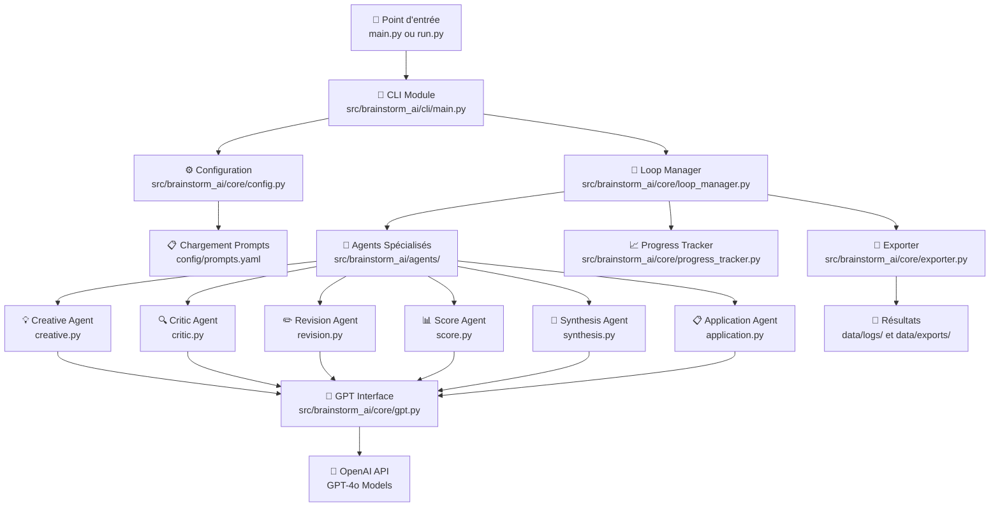
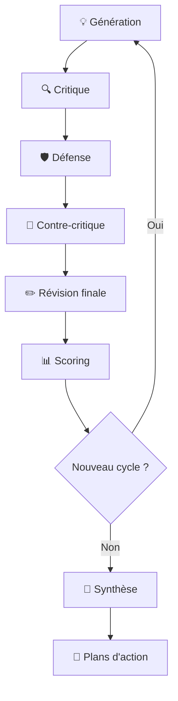

# 🧠 Brainstorm AI

Un système de brainstorming intelligent utilisant plusieurs agents IA spécialisés pour générer, critiquer, défendre et améliorer des idées de manière collaborative.

[](https://www.python.org/downloads/)
[](https://opensource.org/licenses/MIT)
[](docker/)
[](PRIVACY_GUIDELINES.md)

## 🚀 Démarrage Ultra-Rapide

**Nouveau utilisateur ?** → Consultez [QUICK_START.md](QUICK_START.md) pour lancer votre premier brainstorm en 5 minutes !

### 💻 Installation Express

```bash
# Clonage et installation
git clone https://github.com/ShakaTry/brainstorm-ai.git
cd brainstorm-ai
pip install -e .

# Configuration rapide
cp config/env.example .env
# Éditez .env avec votre clé API OpenAI

# Lancement simplifié
python run.py                  # Interface guidée avec assistant
# ou
python start.bat              # Windows : lancement en un clic
```

### 🐳 Déploiement Docker

```bash
# Build et lancement avec Docker Compose
docker-compose up --build

# Ou avec Docker simple
docker build -t brainstorm-ai .
docker run -e OPENAI_API_KEY=votre-clé brainstorm-ai
```

## 🎯 Description

Brainstorm AI simule un processus de brainstorming professionnel avec une équipe d'experts virtuels, chacun ayant un rôle spécialisé dans le processus créatif.

### 🤖 Les Agents Spécialisés

| Agent | Rôle | Température | Spécialité |
|-------|------|-------------|------------|
| **💡 Créatif** | Génération d'idées | 0.9 | Innovation et originalité |
| **🔍 Critique** | Analyse objective | 0.4 | Évaluation rigoureuse |
| **🛡️ Défense** | Amélioration | 0.6 | Argumentation et renforcement |
| **✏️ Révision** | Reformulation | 0.6 | Clarification et optimisation |
| **🧠 Synthèse** | Compilation | 0.5 | Structuration et hiérarchisation |
| **📊 Score** | Évaluation | 0.2 | Notation quantitative |
| **📌 Application** | Plans d'action | 0.6 | Mise en œuvre concrète |

## 🏗️ Architecture et Flux d'Exécution

Voici comment tous les composants interagissent lors d'une session de brainstorming :



> 📋 **Documentation complète** : [Flux d'Exécution Détaillé](docs/SYSTEM_FLOW.md)

## ✨ Caractéristiques Avancées

### 🔥 Nouvelles Fonctionnalités 2024
- **🚀 Scripts de lancement simplifiés** : `run.py` interactif et `start.bat` Windows
- **🔒 Sécurité renforcée** : Protection automatique des données sensibles
- **🐳 Docker optimisé** : Environnement avec GitHub CLI et outils de développement
- **📱 Interface guidée** : Assistant pour configuration et estimations
- **⚡ Performance** : Architecture src/ optimisée pour la vitesse

### 🎯 Fonctionnalités Core
- **Processus itératif** : Système de cycles d'amélioration continue
- **Configuration flexible** : Personnalisation complète via `config/config.yaml`
- **Modèles IA optimisés** : Powered by GPT-4o pour des performances maximales
- **Export multi-format** : YAML, JSON, et Markdown
- **Gestion intelligente** : Détection de redondance et optimisation des tokens
- **Interface intuitive** : Affichage avec emojis et progression en temps réel
- **Historique complet** : Sauvegarde automatique de toutes les sessions

## 🛠️ Installation Détaillée

### Prérequis
- **Python 3.8+** (testé jusqu'à 3.11)
- **Clé API OpenAI** ([Obtenir ici](https://platform.openai.com/api-keys))
- **Git** (pour les fonctionnalités avancées)
- **Docker** (optionnel, pour l'isolation)

### Installation Pip

```bash
# Installation des dépendances
pip install -r requirements.txt

# Mode développement (avec outils de test)
pip install -r requirements-dev.txt

# Installation en mode éditable
pip install -e .
```

### Configuration Sécurisée

```bash
# 1. Copier le modèle de configuration
cp config/env.example .env

# 2. Éditer avec votre clé API (JAMAIS dans Git !)
echo "OPENAI_API_KEY=sk-votre-clé-ici" >> .env

# 3. Vérifier la protection (ne doit PAS apparaître)
git status  # .env doit être ignoré
```

## 🎮 Utilisation

### 🚀 Méthodes de Lancement

#### 1. Assistant Interactif (Recommandé)
```bash
python run.py
```
- Interface guidée pas à pas
- Estimation de coût et durée
- Vérification automatique de configuration
- Valeurs par défaut intelligentes

#### 2. Lancement Windows Simplifié
```bash
start.bat
```
- Double-clic pour lancer
- Gestion d'erreur automatique
- Affichage des résultats

#### 3. Lancement Traditionnel
```bash
python main.py
```
- Mode direct avec confirmation
- Configuration via `config/config.yaml`

### 📋 Configuration Exemple

```yaml
# config/config.yaml
general:
  objectif: "Développer une stratégie de marketing digital innovante"
  contexte: "PME tech en croissance, budget limité, marché concurrentiel"
  contraintes: "Budget max 50K€, délai 6 mois, équipe de 3 personnes"
  cycles: 3
  top_ideas_count: 5

agents:
  models:
    creatif: "gpt-4o"      # Créativité maximale
    critique: "gpt-4o"     # Analyse approfondie
    synthese: "gpt-4o"     # Synthèse de qualité

export:
  formats:
    yaml: true
    json: true
    markdown: true
  auto_export_ideas: false  # Protection confidentialité
```

## 📊 Processus de Brainstorming

### 🔄 Cycle de Développement d'Idées



### 📈 Évolution de la Qualité

| Cycle | Objectif | Résultat Attendu |
|-------|----------|------------------|
| **1** | Exploration large | 3 idées brutes diverses |
| **2** | Approfondissement | 3 idées enrichies et défendues |
| **3** | Perfectionnement | 3 idées finalisées et actionnables |

### 🎯 Synthèse Finale

1. **🧠 Compilation intelligente** : Fusion des meilleures idées
2. **📊 Ranking automatique** : Classement par scores objectifs
3. **📌 Sélection TOP** : Extraction des 3-5 idées les plus prometteuses
4. **📋 Plans détaillés** : Roadmap de mise en œuvre pour chaque idée

## 📁 Structure du Projet

```
brainstorm_ai/
├── 🚀 Lancement rapide
│   ├── run.py                          # Assistant interactif
│   ├── start.bat                       # Lancement Windows
│   └── QUICK_START.md                  # Guide 5 minutes
├── 🧠 Code source
│   └── src/brainstorm_ai/
│       ├── agents/                     # Agents IA spécialisés
│       │   ├── creative.py            # 💡 Génération d'idées
│       │   ├── critic.py              # 🔍 Analyse critique
│       │   ├── revision.py            # ✏️ Révision et amélioration
│       │   ├── synthesis.py           # 🧠 Synthèse finale
│       │   ├── score.py               # 📊 Évaluation quantitative
│       │   └── application.py         # 📌 Plans d'action
│       ├── core/                      # Moteur principal
│       │   ├── gpt.py                 # 🤖 Interface OpenAI optimisée
│       │   ├── loop_manager.py        # 🔄 Orchestration des cycles
│       │   ├── config.py              # ⚙️ Gestion configuration
│       │   ├── exporter.py            # 📤 Export multi-format
│       │   └── progress_tracker.py    # 📊 Suivi temps réel
│       └── cli/                       # Interface ligne de commande
├── ⚙️ Configuration
│   ├── config/
│   │   ├── config.yaml                # Configuration principale
│   │   ├── prompts.yaml               # Prompts optimisés
│   │   └── env.example                # Modèle environnement
├── 🛠️ Outils et scripts
│   ├── scripts/
│   │   ├── check_config.py            # Validation configuration
│   │   ├── cleanup.py                 # Nettoyage projet
│   │   └── demo_progression.py        # Démonstration sans API
├── 📊 Données (🔒 protégées)
│   ├── data/
│   │   ├── logs/                      # Historique sessions
│   │   │   └── example_*.yaml         # ✅ Exemples publics
│   │   └── exports/                   # Idées exportées
│   │       └── example_*.txt          # ✅ Exemples anonymisés
├── 🐳 Containerisation
│   ├── docker/
│   │   ├── Dockerfile                 # Image optimisée avec GitHub CLI
│   │   └── docker-compose.yml         # Stack complète
├── 🧪 Tests
│   ├── tests/
│   │   ├── unit/                      # Tests unitaires
│   │   └── integration/               # Tests d'intégration
├── 📖 Documentation
│   └── docs/
│       ├── ARCHITECTURE.md            # Architecture détaillée
│       ├── cursor.rules               # Règles de développement
│       └── guides/                    # Guides utilisateur
├── 🔒 Sécurité
│   ├── PRIVACY_GUIDELINES.md          # Guide confidentialité
│   └── .gitignore                     # Protection données sensibles
└── 📄 Documentation
    ├── README.md                      # Ce fichier
    └── main.py                        # Point d'entrée legacy
```

## 🔒 Sécurité et Confidentialité

### ⚠️ Protection Automatique

Le projet protège automatiquement vos informations sensibles :

- ✅ **Clés API** : `.env` automatiquement ignoré par Git
- ✅ **Logs personnels** : Seuls les `example_*` sont versionnés
- ✅ **Exports privés** : Vos vraies idées restent locales
- ✅ **Configurations** : Fichiers `*_private.yaml` protégés

### 📖 Guide Complet

**CRITIQUE** : Consultez [PRIVACY_GUIDELINES.md](PRIVACY_GUIDELINES.md) pour :
- 🛡️ Bonnes pratiques de sécurité
- 🔍 Détection de fuites potentielles
- 📋 Checklist avant chaque commit
- 🚨 Procédures d'urgence en cas de fuite

## ⚙️ Configuration Avancée

### 🎯 Optimisation des Modèles

```yaml
# Profils de performance
agents:
  models:
    # Performance maximale (coût élevé)
    performance_max:
      creatif: "gpt-4o"
      critique: "gpt-4o"
      synthese: "gpt-4o"
    
    # Équilibré qualité/coût (recommandé)
    equilibre:
      creatif: "gpt-4o-mini"
      critique: "gpt-4o"
      synthese: "gpt-4o"
    
    # Économique (coût minimal)
    economique:
      creatif: "gpt-4o-mini"
      critique: "gpt-4o-mini"
      synthese: "gpt-4o-mini"
```

### 🎚️ Paramètres de Créativité

```yaml
agents:
  temperatures:
    creatif: 0.9     # 🔥 Maximum de créativité
    critique: 0.4    # 🎯 Analyse rigoureuse
    revision: 0.6    # ⚖️ Équilibre
    synthese: 0.5    # 🧠 Structuration logique
    score: 0.2       # 📊 Évaluation objective
    application: 0.6 # 📌 Pragmatisme
```

### 📤 Formats d'Export

```yaml
export:
  formats:
    yaml: true       # 📋 Données structurées
    json: true       # 🔧 Intégration outils
    markdown: true   # 📖 Documentation lisible
  
  options:
    auto_export_ideas: false     # 🔒 Sécurité par défaut
    include_timestamps: true     # ⏰ Traçabilité
    include_costs: true          # 💰 Transparence
```

## 📈 Optimisations Intégrées

### ⚡ Performance
- **Gestion contexte intelligente** : Optimisation automatique des tokens
- **Cache adaptatif** : Réutilisation des réponses similaires
- **Parallélisation** : Traitement concurrent quand possible
- **Retry intelligent** : Backoff exponentiel avec circuit breaker

### 🧠 IA Optimisée
- **Prompts affinés** : Templates optimisés par rôle
- **Extraction robuste** : Multiples stratégies de parsing
- **Validation croisée** : Vérification de cohérence
- **Détection doublons** : Évite les idées redondantes

### 💰 Gestion Coûts
- **Estimation temps réel** : Coût avant exécution
- **Limits configurable** : Plafonds de sécurité
- **Reporting détaillé** : Tracking token par agent
- **Mode économique** : Profils optimisés coût/qualité

## 🧪 Tests et Qualité

### Lancement des Tests

```bash
# Tests complets
pytest

# Tests avec couverture
pytest --cov=src/brainstorm_ai

# Tests spécifiques
pytest tests/unit/agents/test_creative.py
pytest tests/integration/test_brainstorm_flow.py
```

### 🔍 Validation Qualité

```bash
# Vérification configuration
python scripts/check_config.py

# Nettoyage projet
python scripts/cleanup.py

# Démonstration sans API
python scripts/demo_progression.py
```

## 🤝 Développement et Contribution

### 🚀 Setup Développeur

```bash
# Installation complète
pip install -r requirements-dev.txt

# Pre-commit hooks
pre-commit install

# Tests avant commit
make test
```

### 📋 Checklist Contribution

- [ ] Tests passent (`pytest`)
- [ ] Code formaté (`black`, `isort`)
- [ ] Linting clean (`flake8`)
- [ ] Documentation à jour
- [ ] Pas d'info sensible commitée

### 🔄 Workflow GitHub

```bash
# Fork et branche
git checkout -b feature/amazing-feature

# Développement avec cursor.rules
# (Voir docs/cursor.rules pour les standards)

# Push et PR
git push origin feature/amazing-feature
# Créer PR sur GitHub
```

## 🏆 Cas d'Usage et Exemples

### 💼 Business & Strategy
```yaml
objectif: "Développer une stratégie de diversification"
contexte: "Entreprise manufacturière, 50 employés, croissance 15%/an"
contraintes: "Budget R&D 100K€, timeline 12 mois"
```

### 💡 Innovation Produit
```yaml
objectif: "Créer une app mobile révolutionnaire"
contexte: "Marché saturé, utilisateurs exigeants, concurrence forte"
contraintes: "Équipe 3 dev, budget marketing limité, launch Q1"
```

### 🎯 Résolution Problèmes
```yaml
objectif: "Réduire le churn client de 40%"
contexte: "SaaS B2B, clients PME, support overwhelmed"
contraintes: "Pas d'embauche, solutions rapides, ROI mesurable"
```

## 📊 Résultats Attendus

### 📈 Performance Typique
- **⏱️ Durée session** : 10-30 minutes selon cycles
- **💰 Coût moyen** : 0,50-5€ selon configuration
- **🎯 Idées finales** : 3-5 propositions actionnables
- **📊 Score qualité** : Moyenne 7.5+/10 sur tous critères

### 🏅 Exemple de Sortie

```yaml
# Extrait de synthèse finale
top_ideas:
  1:
    titre: "Plateforme d'Onboarding Gamifiée"
    score_global: 8.7/10
    impact: 9.2/10
    faisabilite: 8.0/10
    plan_action:
      phase_1: "Prototype MVP (2 mois, 15K€)"
      phase_2: "Beta test avec 10 clients (1 mois)"
      phase_3: "Déploiement graduel (3 mois)"
    roi_estime: "ROI 300% en 12 mois"
```

## 🆘 Support et Maintenance

### 📚 Documentation
- **[QUICK_START.md](QUICK_START.md)** : Guide démarrage rapide
- **[PRIVACY_GUIDELINES.md](PRIVACY_GUIDELINES.md)** : Sécurité des données
- **[docs/ARCHITECTURE.md](docs/ARCHITECTURE.md)** : Architecture technique
- **[docs/cursor.rules](docs/cursor.rules)** : Standards de développement

### 🐛 Signalement de Bugs
1. Vérifier les [Issues existantes](https://github.com/ShakaTry/brainstorm-ai/issues)
2. Créer une issue détaillée avec :
   - Version Python/OS
   - Configuration utilisée
   - Logs d'erreur complets
   - Étapes de reproduction

### 💬 Communauté
- **GitHub Discussions** : Questions et idées
- **Issues** : Bugs et améliorations
- **Pull Requests** : Contributions code

## 📄 Licence et Crédits

### 📜 Licence
Ce projet est sous licence **MIT**. Voir [LICENSE](LICENSE) pour détails.

### 🙏 Contributions
- **OpenAI** : GPT-4o pour l'intelligence artificielle
- **Communauté Python** : Écosystème de librairies
- **Contributeurs** : Tous les développeurs ayant amélioré le projet

### 🔗 Liens Utiles
- **Repository** : [github.com/ShakaTry/brainstorm-ai](https://github.com/ShakaTry/brainstorm-ai)
- **Documentation** : [docs/](docs/)
- **Issues** : [GitHub Issues](https://github.com/ShakaTry/brainstorm-ai/issues)

---

🧠 **Brainstorm AI** - *Où l'intelligence artificielle rencontre la créativité humaine*

[](https://github.com/ShakaTry/brainstorm-ai)
[](https://openai.com) 