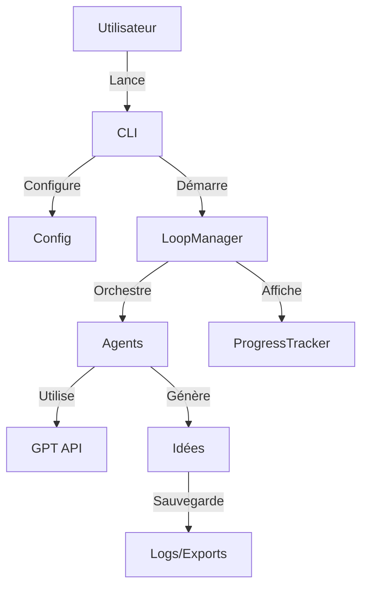

# Architecture du Projet Brainstorm AI

## Vue d'ensemble

Brainstorm AI est une application Python qui utilise des agents IA pour faciliter le processus de brainstorming créatif.

## Structure du Projet

```
brainstorm_ai/
├── src/                      # Code source principal
│   └── brainstorm_ai/        # Module Python principal
│       ├── agents/           # Agents IA spécialisés
│       ├── cli/              # Interface ligne de commande
│       └── core/             # Composants centraux
├── tests/                    # Tests unitaires et intégration
│   ├── unit/                 # Tests unitaires par module
│   └── integration/          # Tests d'intégration
├── docs/                     # Documentation complète
│   ├── api/                  # Documentation API (à venir)
│   ├── guides/               # Guides utilisateur (à venir)
│   └── development/          # Documentation développeur
├── scripts/                  # Scripts utilitaires
├── docker/                   # Configuration Docker
├── config/                   # Fichiers de configuration
├── data/                     # Données générées
│   ├── logs/                 # Journaux d'exécution
│   ├── exports/              # Résultats exportés
│   └── cache/                # Cache temporaire (ignoré)
└── .github/                  # Configuration GitHub Actions
```

## Composants Principaux

### 1. Agents IA (`src/brainstorm_ai/agents/`)

Les agents sont le cœur du système de brainstorming :

- **BaseAgent** : Classe abstraite définissant l'interface commune
- **CreativeAgent** : Génère des idées créatives
- **CriticAgent** : Évalue et critique les idées
- **RevisionAgent** : Améliore les idées existantes
- **ScoreAgent** : Note les idées
- **SynthesisAgent** : Synthétise les résultats
- **ApplicationAgent** : Propose des applications pratiques

### 2. Core (`src/brainstorm_ai/core/`)

Composants centraux du système :

- **Config** : Gestion centralisée de la configuration
- **GPT** : Interface avec l'API OpenAI
- **LoopManager** : Orchestration du cycle de brainstorming
- **ProgressTracker** : Suivi et affichage de la progression
- **Types** : Définitions de types et structures de données
- **Exporter** : Export des résultats en différents formats
- **Utils** : Fonctions utilitaires

### 3. CLI (`src/brainstorm_ai/cli/`)

Interface en ligne de commande pour l'interaction utilisateur.

## Flux de Données



## Technologies Utilisées

- **Python 3.11+** : Langage principal
- **OpenAI API** : GPT-4 pour la génération de contenu
- **YAML** : Configuration
- **Docker** : Containerisation
- **pytest** : Framework de tests
- **mypy** : Vérification de types
- **black/isort** : Formatage du code
- **MkDocs** : Documentation

## Conventions

### Code
- Style : PEP 8 avec Black
- Types : Annotations de types Python
- Docstrings : Format Google
- Tests : pytest avec couverture > 80%

### Git
- Branches : `main`, `develop`, `feature/*`
- Commits : Convention conventionnelle
- Tags : Versioning sémantique

### Documentation
- README dans chaque dossier important
- Docstrings pour toutes les fonctions publiques
- Guides utilisateur dans `docs/`

## Configuration

La configuration est centralisée dans `config/config.yaml` avec :
- Paramètres des agents
- Configuration API
- Options de logging
- Paramètres d'export

## Déploiement

### Local
```bash
pip install -r requirements.txt
python main.py
```

### Docker
```bash
docker-compose up
```

## Maintenance

- Logs rotatifs dans `data/logs/`
- Cache vidé automatiquement
- Exports archivés selon besoin
- Tests exécutés via CI/CD 