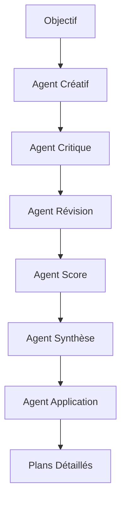

# Brainstorm AI

Bienvenue dans la documentation de **Brainstorm AI**, un système multi-agents innovant pour le brainstorming créatif alimenté par GPT.

<div align="center">
    
</div>

## 🚀 Vue d'ensemble

Brainstorm AI utilise une approche multi-agents pour générer, critiquer, améliorer et sélectionner des idées créatives. Le système simule une séance de brainstorming complète avec différents rôles spécialisés.

### ✨ Fonctionnalités principales

- **🤖 6 Agents Spécialisés** : Chaque agent a un rôle unique dans le processus créatif
- **🔄 Processus Itératif** : Cycles de création, critique et amélioration
- **📊 Évaluation Objective** : Scoring multi-critères des idées
- **💡 Plans Détaillés** : Génération automatique de plans de mise en œuvre
- **📈 Suivi en Temps Réel** : Progression et statistiques d'utilisation
- **💰 Optimisation des Coûts** : Gestion intelligente des appels API

## 🎯 Pour qui ?

Brainstorm AI est conçu pour :

- **Entrepreneurs** cherchant des idées innovantes
- **Équipes créatives** en manque d'inspiration
- **Consultants** facilitant des sessions de brainstorming
- **Développeurs** explorant de nouvelles fonctionnalités
- **Chercheurs** générant des hypothèses

## 🏗️ Architecture

Le système est basé sur une architecture modulaire avec 6 agents spécialisés :



## 📖 Guide de démarrage rapide

### Installation

```bash
# Cloner le repository
git clone https://github.com/brainstorm-ai/brainstorm-ai.git
cd brainstorm-ai

# Installer les dépendances
pip install -r requirements.txt

# Configurer la clé API
cp env.example .env
# Éditer .env et ajouter votre clé OpenAI
```

### Premier brainstorming

```bash
# Lancer avec la configuration par défaut
python main.py

# Ou utiliser Docker
docker-compose up
```

### Configuration minimale

```yaml
# config.yaml
general:
  objectif: "Créer une application mobile innovante"
  contexte: "Startup avec budget limité"
  contraintes: "Doit être rentable en 6 mois"
  cycles: 3
```

## 📚 Documentation complète

<div class="grid cards" markdown>

-   :material-rocket-launch: __[Guide de démarrage](getting-started/installation.md)__

    ---

    Installation, configuration et premier brainstorming

-   :material-brain: __[Concepts](concepts/architecture.md)__

    ---

    Architecture, agents et flux de travail

-   :material-api: __[Référence API](api/core/config.md)__

    ---

    Documentation technique complète

-   :material-tune: __[Guides avancés](advanced/cost-optimization.md)__

    ---

    Optimisation, personnalisation et intégration

</div>

## 🤝 Contribuer

Nous accueillons toutes les contributions ! Consultez notre [guide de contribution](contributing.md) pour commencer.

### Développement rapide

```bash
# Configuration de l'environnement de dev
make setup

# Lancer les tests
make test

# Vérifier le code
make check
```

## 📊 Statistiques du projet


## 📄 License

Ce projet est sous licence MIT. Voir le fichier [LICENSE](https://github.com/brainstorm-ai/brainstorm-ai/blob/main/LICENSE) pour plus de détails.

---

<div align="center">
    Fait avec ❤️ par la communauté Brainstorm AI
</div> 