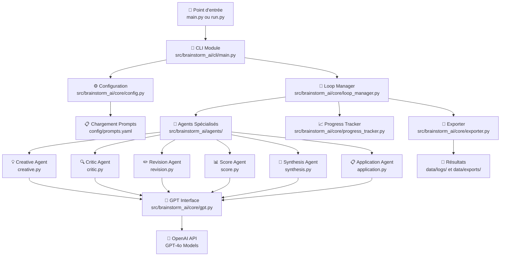

# 🔄 Flux d'Exécution du Système Brainstorm AI

Ce document décrit l'architecture et le flux d'exécution complet du système de brainstorming multi-agents.

## 📊 Diagramme d'Architecture



## 🔄 Étapes d'Exécution Détaillées

### 1. 🚀 Points d'Entrée

**Fichiers :**
- `main.py` - Point d'entrée principal
- `run.py` - Interface utilisateur simplifiée et interactive

**Rôle :** Validation des prérequis et redirection vers le CLI principal.

### 2. 🔧 Module CLI

**Fichier :** `src/brainstorm_ai/cli/main.py`

**Responsabilités :**
- Validation de la clé API OpenAI
- Affichage des paramètres de configuration
- Estimation des coûts
- Lancement du processus de brainstorming

### 3. ⚙️ Système de Configuration

**Fichiers :**
- `src/brainstorm_ai/core/config.py` - Gestionnaire de configuration singleton
- `config/config.yaml` - Paramètres système (modèles, températures, cycles)
- `config/prompts.yaml` - Templates des prompts pour chaque agent

**Fonctionnalités :**
- Chargement thread-safe de la configuration
- Gestion des modèles GPT par rôle
- Calcul automatique des coûts API
- Validation des paramètres

### 4. 🔄 Gestionnaire de Boucles

**Fichier :** `src/brainstorm_ai/core/loop_manager.py`

**Fonctions principales :**
- `run_brainstorm_loop()` - Orchestrateur principal
- `traiter_cycle()` - Gestion d'un cycle complet d'agents
- `process_ideas()` - Développement des plans d'application
- `save_full_log()` - Sauvegarde et export des résultats

### 5. 🧠 Agents Spécialisés

**Répertoire :** `src/brainstorm_ai/agents/`

#### Architecture des Agents

Chaque agent hérite de `BaseAgent` et implémente :
- **Classe orientée objet** pour la logique métier
- **Fonctions de compatibilité** pour l'interface avec loop_manager

#### Agents Disponibles

| Agent | Fichier | Rôle | Température |
|-------|---------|------|-------------|
| 💡 **Créatif** | `creative.py` | Génération d'idées innovantes | 0.9 |
| 🔍 **Critique** | `critic.py` | Analyse objective et constructive | 0.4 |
| ✏️ **Révision** | `revision.py` | Amélioration et reformulation | 0.6 |
| 📊 **Score** | `score.py` | Évaluation quantitative (JSON) | 0.2 |
| 🧠 **Synthèse** | `synthesis.py` | Consolidation et sélection | 0.5 |
| 📋 **Application** | `application.py` | Plans de mise en œuvre | 0.6 |

### 6. 🔌 Interface GPT

**Fichier :** `src/brainstorm_ai/core/gpt.py`

**Fonctionnalités :**
- Client OpenAI singleton avec retry automatique
- Gestion des rate limits avec backoff exponentiel
- Calcul automatique des coûts par modèle
- Statistiques d'utilisation en temps réel
- Support multi-modèles (GPT-4o, GPT-4o-mini, etc.)

### 7. 📈 Suivi de Progression

**Fichier :** `src/brainstorm_ai/core/progress_tracker.py`

**Fonctionnalités :**
- Barres de progression par cycle et agent
- Estimation de durée restante
- Affichage des coûts en temps réel
- Interface utilisateur avec émojis

### 8. 💾 Système d'Export

**Fichier :** `src/brainstorm_ai/core/exporter.py`

**Formats supportés :**
- **YAML** - Logs complets structurés
- **JSON** - Données pour intégration API
- **Markdown** - Documentation lisible

**Emplacements :**
- `data/logs/` - Sessions complètes
- `data/exports/` - Idées individuelles

## 🎯 Cycle de Brainstorming (Détail)

### Phase 1 : Génération et Critique (Par Cycle)

```
1. 💡 Créatif génère 3 idées innovantes
   ↓
2. 🔍 Critique analyse objectivement
   ↓
3. 🛡️ Créatif défend ses idées
   ↓
4. 🔄 Critique évalue la défense
   ↓
5. ✏️ Révision améliore l'idée finale
   ↓
6. 📊 Score évalue (impact, faisabilité, originalité, clarté)
```

### Phase 2 : Synthèse Globale

```
🧠 Synthèse analyse TOUTES les révisions
   ↓
Sélectionne les 3-5 meilleures idées
   ↓
Classement par pertinence
```

### Phase 3 : Développement d'Applications

```
Pour chaque idée sélectionnée :
1. 📋 Création de plan détaillé
2. 🔍 Critique du plan
3. 🛡️ Défense et ajustements
4. ✏️ Plan final optimisé
```

## 🔧 Optimisations Techniques

### Gestion des Erreurs
- **Retry automatique** avec backoff exponentiel
- **Fallback prompts** si fichiers manquants
- **Validation JSON** pour les scores

### Performance
- **Singleton thread-safe** pour configuration
- **Cache LRU** pour estimation tokens
- **Déduplication** automatique des idées

### Monitoring
- **Tracking coûts** en temps réel
- **Logs détaillés** par agent et cycle
- **Statistiques API** complètes

## 📁 Structure des Données

### Log de Session Complète

```yaml
brainstorm_log:
  metadata:
    timestamp: "2024-01-15_14-30-22"
    objectif: "..."
    contexte: "..."
    contraintes: "..."
    cycles_count: 3
    top_ideas_count: 5
  
  cycles:
    - cycle: 1
      creation: "..."
      critique: "..."
      defense: "..."
      replique: "..."
      revision: "..."
      score:
        impact: 8
        faisabilite: 7
        originalite: 9
        clarte: 8
  
  synthese: "..."
  
  applications:
    - idee: "..."
      plan_initial: "..."
      critique: "..."
      defense: "..."
      revision: "..."
  
  statistics:
    total_tokens: 15420
    total_cost: 2.34
    api_calls: 23
    duration_seconds: 180
```

## 🚀 Points d'Extension

### Nouveaux Agents
1. Hériter de `BaseAgent`
2. Implémenter les prompts dans `config/prompts.yaml`
3. Ajouter au `loop_manager.py`

### Nouveaux Formats d'Export
1. Ajouter fonction dans `exporter.py`
2. Configurer dans `config.yaml`

### Nouveaux Modèles GPT
1. Ajouter pricing dans `config.yaml`
2. Configurer par rôle selon les besoins

---

*Ce diagramme et cette documentation sont maintenus à jour avec l'évolution du système.* 